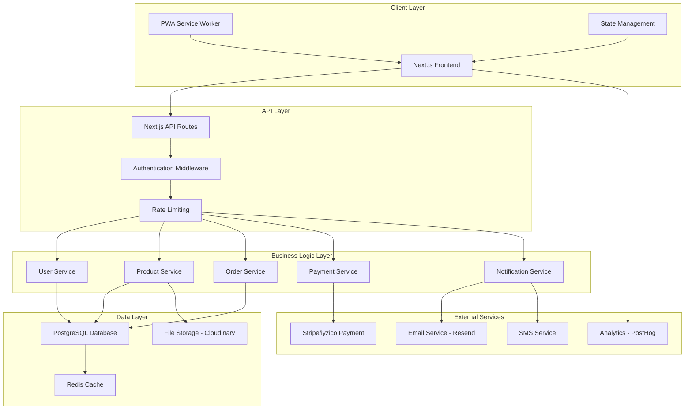

[design.md](https://github.com/user-attachments/files/21593130/design.md)
# Design Document

## Overview

Bu e-ticaret platformu, Next.js 14 App Router tabanlı, modern web teknolojileri kullanarak geliştirilecek kapsamlı bir çözümdür. Clean Architecture prensiplerine uygun olarak tasarlanan sistem, yüksek performans, güvenlik ve ölçeklenebilirlik odaklıdır. Platform, SSR/SSG optimizasyonları ile SEO dostu, PWA desteği ile mobil-first yaklaşımı benimser.

## Architecture

### High-Level Architecture



### Directory Structure

```
/app (Next.js App Router)
├── (auth)/
│   ├── login/
│   ├── register/
│   └── reset-password/
├── (shop)/
│   ├── products/
│   ├── category/[slug]/
│   ├── cart/
│   └── checkout/
├── (user)/
│   ├── profile/
│   ├── orders/
│   └── favorites/
├── (admin)/
│   ├── dashboard/
│   ├── products/
│   ├── orders/
│   └── users/
├── api/
│   ├── auth/
│   ├── products/
│   ├── orders/
│   ├── payments/
│   └── admin/
├── globals.css
└── layout.tsx

/components
├── ui/ (Shadcn/UI components)
├── forms/
├── layout/
├── product/
├── cart/
└── admin/

/features
├── auth/
│   ├── components/
│   ├── hooks/
│   ├── services/
│   └── types/
├── products/
├── cart/
├── orders/
├── admin/
└── notifications/

/lib
├── auth.ts
├── db.ts
├── validations.ts
├── utils.ts
└── constants.ts

/hooks
├── useAuth.ts
├── useCart.ts
├── useProducts.ts
└── useOrders.ts

/services
├── api.ts
├── payment.ts
├── email.ts
├── upload.ts
└── analytics.ts

/context
├── AuthContext.tsx
├── CartContext.tsx
└── ThemeContext.tsx

/types
├── auth.ts
├── product.ts
├── order.ts
└── api.ts
```

## Components and Interfaces

### Core Components Architecture

#### 1. Authentication System

```typescript
// NextAuth.js Configuration
interface AuthConfig {
  providers: [GoogleProvider, FacebookProvider, CredentialsProvider];
  callbacks: {
    jwt: JWTCallback;
    session: SessionCallback;
  };
  pages: {
    signIn: "/login";
    signUp: "/register";
    error: "/auth/error";
  };
}

// User Management Service
interface UserService {
  register(userData: RegisterData): Promise<User>;
  login(credentials: LoginData): Promise<AuthResult>;
  resetPassword(email: string): Promise<void>;
  updateProfile(userId: string, data: ProfileData): Promise<User>;
  verifyEmail(token: string): Promise<boolean>;
}
```

#### 2. Product Management System

```typescript
// Product Service Interface
interface ProductService {
  getProducts(filters: ProductFilters): Promise<ProductPage>;
  getProduct(id: string): Promise<Product>;
  createProduct(data: CreateProductData): Promise<Product>;
  updateProduct(id: string, data: UpdateProductData): Promise<Product>;
  deleteProduct(id: string): Promise<void>;
  updateStock(id: string, quantity: number): Promise<void>;
}

// Product Component Structure
const ProductCard = {
  image: OptimizedImage,
  title: string,
  price: PriceDisplay,
  rating: StarRating,
  actions: [AddToCart, AddToFavorites],
};

const ProductDetail = {
  gallery: ImageGallery,
  info: ProductInfo,
  variants: VariantSelector,
  actions: ProductActions,
  reviews: ReviewSection,
  recommendations: RelatedProducts,
};
```

#### 3. Shopping Cart System

```typescript
// Cart State Management (Zustand)
interface CartStore {
  items: CartItem[];
  addItem: (product: Product, quantity: number) => void;
  removeItem: (productId: string) => void;
  updateQuantity: (productId: string, quantity: number) => void;
  clearCart: () => void;
  getTotal: () => number;
  syncWithServer: () => Promise<void>;
}

// Cart Persistence Strategy
const CartPersistence = {
  localStorage: LocalStorageAdapter,
  database: DatabaseAdapter,
  sync: SyncManager,
};
```

#### 4. Order Management System

```typescript
// Order Processing Pipeline
interface OrderService {
  createOrder(cartData: CartData): Promise<Order>;
  processPayment(
    orderId: string,
    paymentData: PaymentData
  ): Promise<PaymentResult>;
  updateOrderStatus(orderId: string, status: OrderStatus): Promise<void>;
  getOrderHistory(userId: string): Promise<Order[]>;
  trackOrder(orderId: string): Promise<OrderTracking>;
}

// Order Status Flow
enum OrderStatus {
  PENDING = "pending",
  CONFIRMED = "confirmed",
  PROCESSING = "processing",
  SHIPPED = "shipped",
  DELIVERED = "delivered",
  CANCELLED = "cancelled",
}
```

#### 5. Admin Panel Architecture

```typescript
// Admin Dashboard Components
const AdminLayout = {
  sidebar: AdminSidebar,
  header: AdminHeader,
  content: AdminContent,
  notifications: AdminNotifications,
};

// Admin Services
interface AdminService {
  getDashboardStats(): Promise<DashboardStats>;
  manageProducts(): ProductManagement;
  manageOrders(): OrderManagement;
  manageUsers(): UserManagement;
  manageCampaigns(): CampaignManagement;
}
```

## Data Models

### Database Schema Design

```sql
-- Users Table
CREATE TABLE users (
  id UUID PRIMARY KEY DEFAULT gen_random_uuid(),
  email VARCHAR(255) UNIQUE NOT NULL,
  password_hash VARCHAR(255),
  name VARCHAR(255) NOT NULL,
  phone VARCHAR(20),
  role user_role DEFAULT 'customer',
  email_verified BOOLEAN DEFAULT false,
  created_at TIMESTAMP DEFAULT NOW(),
  updated_at TIMESTAMP DEFAULT NOW()
);

-- User Addresses
CREATE TABLE user_addresses (
  id UUID PRIMARY KEY DEFAULT gen_random_uuid(),
  user_id UUID REFERENCES users(id) ON DELETE CASCADE,
  title VARCHAR(100) NOT NULL,
  address_line1 VARCHAR(255) NOT NULL,
  address_line2 VARCHAR(255),
  city VARCHAR(100) NOT NULL,
  state VARCHAR(100),
  postal_code VARCHAR(20) NOT NULL,
  country VARCHAR(100) NOT NULL,
  is_default BOOLEAN DEFAULT false,
  created_at TIMESTAMP DEFAULT NOW()
);

-- Categories
CREATE TABLE categories (
  id UUID PRIMARY KEY DEFAULT gen_random_uuid(),
  name VARCHAR(255) NOT NULL,
  slug VARCHAR(255) UNIQUE NOT NULL,
  description TEXT,
  parent_id UUID REFERENCES categories(id),
  image_url VARCHAR(500),
  meta_title VARCHAR(255),
  meta_description TEXT,
  is_active BOOLEAN DEFAULT true,
  sort_order INTEGER DEFAULT 0,
  created_at TIMESTAMP DEFAULT NOW()
);

-- Products
CREATE TABLE products (
  id UUID PRIMARY KEY DEFAULT gen_random_uuid(),
  name VARCHAR(255) NOT NULL,
  slug VARCHAR(255) UNIQUE NOT NULL,
  description TEXT,
  short_description VARCHAR(500),
  sku VARCHAR(100) UNIQUE NOT NULL,
  price DECIMAL(10,2) NOT NULL,
  compare_price DECIMAL(10,2),
  cost_price DECIMAL(10,2),
  track_inventory BOOLEAN DEFAULT true,
  inventory_quantity INTEGER DEFAULT 0,
  weight DECIMAL(8,2),
  category_id UUID REFERENCES categories(id),
  brand VARCHAR(255),
  status product_status DEFAULT 'draft',
  featured BOOLEAN DEFAULT false,
  meta_title VARCHAR(255),
  meta_description TEXT,
  created_at TIMESTAMP DEFAULT NOW(),
  updated_at TIMESTAMP DEFAULT NOW()
);

-- Product Images
CREATE TABLE product_images (
  id UUID PRIMARY KEY DEFAULT gen_random_uuid(),
  product_id UUID REFERENCES products(id) ON DELETE CASCADE,
  url VARCHAR(500) NOT NULL,
  alt_text VARCHAR(255),
  sort_order INTEGER DEFAULT 0,
  created_at TIMESTAMP DEFAULT NOW()
);

-- Product Variants
CREATE TABLE product_variants (
  id UUID PRIMARY KEY DEFAULT gen_random_uuid(),
  product_id UUID REFERENCES products(id) ON DELETE CASCADE,
  name VARCHAR(255) NOT NULL,
  sku VARCHAR(100) UNIQUE NOT NULL,
  price DECIMAL(10,2),
  inventory_quantity INTEGER DEFAULT 0,
  option1_name VARCHAR(100),
  option1_value VARCHAR(100),
  option2_name VARCHAR(100),
  option2_value VARCHAR(100),
  option3_name VARCHAR(100),
  option3_value VARCHAR(100),
  created_at TIMESTAMP DEFAULT NOW()
);

-- Shopping Cart
CREATE TABLE cart_items (
  id UUID PRIMARY KEY DEFAULT gen_random_uuid(),
  user_id UUID REFERENCES users(id) ON DELETE CASCADE,
  session_id VARCHAR(255),
  product_id UUID REFERENCES products(id) ON DELETE CASCADE,
  variant_id UUID REFERENCES product_variants(id) ON DELETE CASCADE,
  quantity INTEGER NOT NULL DEFAULT 1,
  created_at TIMESTAMP DEFAULT NOW(),
  updated_at TIMESTAMP DEFAULT NOW()
);

-- Orders
CREATE TABLE orders (
  id UUID PRIMARY KEY DEFAULT gen_random_uuid(),
  order_number VARCHAR(50) UNIQUE NOT NULL,
  user_id UUID REFERENCES users(id),
  email VARCHAR(255) NOT NULL,
  status order_status DEFAULT 'pending',
  subtotal DECIMAL(10,2) NOT NULL,
  tax_amount DECIMAL(10,2) DEFAULT 0,
  shipping_amount DECIMAL(10,2) DEFAULT 0,
  discount_amount DECIMAL(10,2) DEFAULT 0,
  total_amount DECIMAL(10,2) NOT NULL,
  currency VARCHAR(3) DEFAULT 'TRY',
  payment_status payment_status DEFAULT 'pending',
  payment_method VARCHAR(50),
  shipping_address JSONB,
  billing_address JSONB,
  notes TEXT,
  created_at TIMESTAMP DEFAULT NOW(),
  updated_at TIMESTAMP DEFAULT NOW()
);

-- Order Items
CREATE TABLE order_items (
  id UUID PRIMARY KEY DEFAULT gen_random_uuid(),
  order_id UUID REFERENCES orders(id) ON DELETE CASCADE,
  product_id UUID REFERENCES products(id),
  variant_id UUID REFERENCES product_variants(id),
  product_name VARCHAR(255) NOT NULL,
  variant_name VARCHAR(255),
  quantity INTEGER NOT NULL,
  unit_price DECIMAL(10,2) NOT NULL,
  total_price DECIMAL(10,2) NOT NULL,
  created_at TIMESTAMP DEFAULT NOW()
);

-- Discounts and Coupons
CREATE TABLE discounts (
  id UUID PRIMARY KEY DEFAULT gen_random_uuid(),
  code VARCHAR(50) UNIQUE NOT NULL,
  type discount_type NOT NULL,
  value DECIMAL(10,2) NOT NULL,
  minimum_amount DECIMAL(10,2),
  usage_limit INTEGER,
  used_count INTEGER DEFAULT 0,
  starts_at TIMESTAMP,
  ends_at TIMESTAMP,
  is_active BOOLEAN DEFAULT true,
  created_at TIMESTAMP DEFAULT NOW()
);

-- Favorites/Wishlist
CREATE TABLE favorites (
  id UUID PRIMARY KEY DEFAULT gen_random_uuid(),
  user_id UUID REFERENCES users(id) ON DELETE CASCADE,
  product_id UUID REFERENCES products(id) ON DELETE CASCADE,
  created_at TIMESTAMP DEFAULT NOW(),
  UNIQUE(user_id, product_id)
);

-- Blog Posts
CREATE TABLE blog_posts (
  id UUID PRIMARY KEY DEFAULT gen_random_uuid(),
  title VARCHAR(255) NOT NULL,
  slug VARCHAR(255) UNIQUE NOT NULL,
  content TEXT NOT NULL,
  excerpt VARCHAR(500),
  featured_image VARCHAR(500),
  author_id UUID REFERENCES users(id),
  category VARCHAR(100),
  tags TEXT[],
  status post_status DEFAULT 'draft',
  meta_title VARCHAR(255),
  meta_description TEXT,
  published_at TIMESTAMP,
  created_at TIMESTAMP DEFAULT NOW(),
  updated_at TIMESTAMP DEFAULT NOW()
);

-- Reviews
CREATE TABLE product_reviews (
  id UUID PRIMARY KEY DEFAULT gen_random_uuid(),
  product_id UUID REFERENCES products(id) ON DELETE CASCADE,
  user_id UUID REFERENCES users(id) ON DELETE CASCADE,
  order_id UUID REFERENCES orders(id),
  rating INTEGER CHECK (rating >= 1 AND rating <= 5),
  title VARCHAR(255),
  content TEXT,
  is_verified BOOLEAN DEFAULT false,
  is_approved BOOLEAN DEFAULT false,
  created_at TIMESTAMP DEFAULT NOW()
);

-- Notifications
CREATE TABLE notifications (
  id UUID PRIMARY KEY DEFAULT gen_random_uuid(),
  user_id UUID REFERENCES users(id) ON DELETE CASCADE,
  type notification_type NOT NULL,
  title VARCHAR(255) NOT NULL,
  message TEXT NOT NULL,
  data JSONB,
  is_read BOOLEAN DEFAULT false,
  created_at TIMESTAMP DEFAULT NOW()
);

-- Enums
CREATE TYPE user_role AS ENUM ('customer', 'admin', 'moderator');
CREATE TYPE product_status AS ENUM ('draft', 'active', 'archived');
CREATE TYPE order_status AS ENUM ('pending', 'confirmed', 'processing', 'shipped', 'delivered', 'cancelled', 'refunded');
CREATE TYPE payment_status AS ENUM ('pending', 'paid', 'failed', 'refunded');
CREATE TYPE discount_type AS ENUM ('percentage', 'fixed_amount');
CREATE TYPE post_status AS ENUM ('draft', 'published', 'archived');
CREATE TYPE notification_type AS ENUM ('order_update', 'stock_alert', 'promotion', 'system');
```

### TypeScript Interfaces

```typescript
// Core Types
interface User {
  id: string;
  email: string;
  name: string;
  phone?: string;
  role: "customer" | "admin" | "moderator";
  emailVerified: boolean;
  addresses: Address[];
  createdAt: Date;
  updatedAt: Date;
}

interface Product {
  id: string;
  name: string;
  slug: string;
  description: string;
  shortDescription?: string;
  sku: string;
  price: number;
  comparePrice?: number;
  costPrice?: number;
  trackInventory: boolean;
  inventoryQuantity: number;
  weight?: number;
  category: Category;
  brand?: string;
  status: "draft" | "active" | "archived";
  featured: boolean;
  images: ProductImage[];
  variants: ProductVariant[];
  metaTitle?: string;
  metaDescription?: string;
  createdAt: Date;
  updatedAt: Date;
}

interface Order {
  id: string;
  orderNumber: string;
  user?: User;
  email: string;
  status: OrderStatus;
  subtotal: number;
  taxAmount: number;
  shippingAmount: number;
  discountAmount: number;
  totalAmount: number;
  currency: string;
  paymentStatus: PaymentStatus;
  paymentMethod?: string;
  shippingAddress: Address;
  billingAddress: Address;
  items: OrderItem[];
  notes?: string;
  createdAt: Date;
  updatedAt: Date;
}
```

## Error Handling

### Error Handling Strategy

```typescript
// Global Error Handler
class AppError extends Error {
  statusCode: number;
  isOperational: boolean;

  constructor(message: string, statusCode: number) {
    super(message);
    this.statusCode = statusCode;
    this.isOperational = true;
    Error.captureStackTrace(this, this.constructor);
  }
}

// API Error Responses
interface ApiErrorResponse {
  success: false;
  error: {
    code: string;
    message: string;
    details?: any;
  };
  timestamp: string;
  path: string;
}

// Error Types
enum ErrorCodes {
  VALIDATION_ERROR = "VALIDATION_ERROR",
  AUTHENTICATION_ERROR = "AUTHENTICATION_ERROR",
  AUTHORIZATION_ERROR = "AUTHORIZATION_ERROR",
  NOT_FOUND = "NOT_FOUND",
  PAYMENT_ERROR = "PAYMENT_ERROR",
  INVENTORY_ERROR = "INVENTORY_ERROR",
  RATE_LIMIT_ERROR = "RATE_LIMIT_ERROR",
  INTERNAL_ERROR = "INTERNAL_ERROR",
}

// Error Handling Middleware
const errorHandler = (error: Error, req: Request, res: Response) => {
  if (error instanceof AppError) {
    return res.status(error.statusCode).json({
      success: false,
      error: {
        code: error.name,
        message: error.message,
      },
      timestamp: new Date().toISOString(),
      path: req.path,
    });
  }

  // Log unexpected errors
  logger.error("Unexpected error:", error);

  return res.status(500).json({
    success: false,
    error: {
      code: "INTERNAL_ERROR",
      message: "Internal server error",
    },
    timestamp: new Date().toISOString(),
    path: req.path,
  });
};
```

### Client-Side Error Handling

```typescript
// React Error Boundary
class ErrorBoundary extends Component<Props, State> {
  constructor(props: Props) {
    super(props);
    this.state = { hasError: false, error: null };
  }

  static getDerivedStateFromError(error: Error): State {
    return { hasError: true, error };
  }

  componentDidCatch(error: Error, errorInfo: ErrorInfo) {
    // Log error to monitoring service
    analytics.track("error", {
      error: error.message,
      stack: error.stack,
      componentStack: errorInfo.componentStack,
    });
  }

  render() {
    if (this.state.hasError) {
      return <ErrorFallback error={this.state.error} />;
    }

    return this.props.children;
  }
}

// API Error Handling Hook
const useApiError = () => {
  const [error, setError] = useState<ApiError | null>(null);

  const handleError = useCallback((error: unknown) => {
    if (error instanceof ApiError) {
      setError(error);
      toast.error(error.message);
    } else {
      const genericError = new ApiError("Bir hata oluştu", "UNKNOWN_ERROR");
      setError(genericError);
      toast.error(genericError.message);
    }
  }, []);

  const clearError = useCallback(() => {
    setError(null);
  }, []);

  return { error, handleError, clearError };
};
```

## Testing Strategy

### Testing Pyramid

```typescript
// Unit Tests (Jest + Testing Library)
describe("ProductService", () => {
  it("should create product with valid data", async () => {
    const productData = {
      name: "Test Product",
      price: 99.99,
      categoryId: "cat-1",
    };

    const product = await productService.createProduct(productData);

    expect(product).toMatchObject({
      name: "Test Product",
      price: 99.99,
      slug: "test-product",
    });
  });

  it("should throw error for invalid price", async () => {
    const productData = {
      name: "Test Product",
      price: -10,
      categoryId: "cat-1",
    };

    await expect(productService.createProduct(productData)).rejects.toThrow(
      "Price must be positive"
    );
  });
});

// Integration Tests
describe("Product API", () => {
  it("should return products with pagination", async () => {
    const response = await request(app)
      .get("/api/products?page=1&limit=10")
      .expect(200);

    expect(response.body).toMatchObject({
      success: true,
      data: {
        products: expect.any(Array),
        pagination: {
          page: 1,
          limit: 10,
          total: expect.any(Number),
        },
      },
    });
  });
});

// E2E Tests (Playwright)
test("complete purchase flow", async ({ page }) => {
  // Navigate to product
  await page.goto("/products/test-product");

  // Add to cart
  await page.click('[data-testid="add-to-cart"]');

  // Go to cart
  await page.click('[data-testid="cart-icon"]');

  // Proceed to checkout
  await page.click('[data-testid="checkout-button"]');

  // Fill shipping info
  await page.fill('[data-testid="shipping-name"]', "John Doe");
  await page.fill('[data-testid="shipping-email"]', "john@example.com");

  // Complete payment (test mode)
  await page.click('[data-testid="complete-order"]');

  // Verify success
  await expect(page.locator('[data-testid="order-success"]')).toBeVisible();
});
```

### Performance Testing

```typescript
// Load Testing Configuration
const loadTestConfig = {
  scenarios: {
    product_browsing: {
      executor: "ramping-vus",
      startVUs: 0,
      stages: [
        { duration: "2m", target: 100 },
        { duration: "5m", target: 100 },
        { duration: "2m", target: 200 },
        { duration: "5m", target: 200 },
        { duration: "2m", target: 0 },
      ],
    },
    checkout_flow: {
      executor: "constant-vus",
      vus: 50,
      duration: "10m",
    },
  },
  thresholds: {
    http_req_duration: ["p(95)<2000"],
    http_req_failed: ["rate<0.1"],
  },
};

// Performance Monitoring
const performanceMetrics = {
  webVitals: {
    LCP: "<2.5s", // Largest Contentful Paint
    FID: "<100ms", // First Input Delay
    CLS: "<0.1", // Cumulative Layout Shift
  },
  apiResponse: {
    p95: "<500ms",
    p99: "<1000ms",
  },
  database: {
    queryTime: "<100ms",
    connectionPool: "healthy",
  },
};
```

## Security Considerations

### Security Implementation

```typescript
// Authentication & Authorization
const authMiddleware = {
  verifyToken: async (token: string) => {
    try {
      const decoded = jwt.verify(token, process.env.JWT_SECRET!);
      return decoded as JWTPayload;
    } catch (error) {
      throw new AppError("Invalid token", 401);
    }
  },

  requireAuth: (req: Request, res: Response, next: NextFunction) => {
    const token = req.headers.authorization?.replace("Bearer ", "");
    if (!token) {
      throw new AppError("Authentication required", 401);
    }
    // Verify token and attach user to request
  },

  requireRole: (roles: string[]) => {
    return (req: Request, res: Response, next: NextFunction) => {
      if (!roles.includes(req.user.role)) {
        throw new AppError("Insufficient permissions", 403);
      }
      next();
    };
  },
};

// Input Validation & Sanitization
const validationSchemas = {
  createProduct: z.object({
    name: z.string().min(1).max(255).trim(),
    price: z.number().positive(),
    description: z.string().max(5000).optional(),
    categoryId: z.string().uuid(),
  }),

  updateUser: z.object({
    name: z.string().min(1).max(255).trim(),
    email: z.string().email(),
    phone: z
      .string()
      .regex(/^\+?[1-9]\d{1,14}$/)
      .optional(),
  }),
};

// Rate Limiting
const rateLimitConfig = {
  windowMs: 15 * 60 * 1000, // 15 minutes
  max: 100, // limit each IP to 100 requests per windowMs
  message: "Too many requests from this IP",
  standardHeaders: true,
  legacyHeaders: false,
};

// CSRF Protection
const csrfProtection = csrf({
  cookie: {
    httpOnly: true,
    secure: process.env.NODE_ENV === "production",
    sameSite: "strict",
  },
});

// Content Security Policy
const cspConfig = {
  directives: {
    defaultSrc: ["'self'"],
    styleSrc: ["'self'", "'unsafe-inline'", "https://fonts.googleapis.com"],
    fontSrc: ["'self'", "https://fonts.gstatic.com"],
    imgSrc: ["'self'", "data:", "https://res.cloudinary.com"],
    scriptSrc: ["'self'", "'unsafe-eval'"],
    connectSrc: ["'self'", "https://api.stripe.com"],
  },
};
```

### Data Protection

```typescript
// Encryption Utilities
const encryption = {
  hashPassword: async (password: string): Promise<string> => {
    const saltRounds = 12;
    return bcrypt.hash(password, saltRounds);
  },

  verifyPassword: async (password: string, hash: string): Promise<boolean> => {
    return bcrypt.compare(password, hash);
  },

  encryptSensitiveData: (data: string): string => {
    const cipher = crypto.createCipher(
      "aes-256-cbc",
      process.env.ENCRYPTION_KEY!
    );
    let encrypted = cipher.update(data, "utf8", "hex");
    encrypted += cipher.final("hex");
    return encrypted;
  },

  decryptSensitiveData: (encryptedData: string): string => {
    const decipher = crypto.createDecipher(
      "aes-256-cbc",
      process.env.ENCRYPTION_KEY!
    );
    let decrypted = decipher.update(encryptedData, "hex", "utf8");
    decrypted += decipher.final("utf8");
    return decrypted;
  },
};

// PII Data Handling
const piiHandler = {
  maskEmail: (email: string): string => {
    const [username, domain] = email.split("@");
    const maskedUsername =
      username.slice(0, 2) + "*".repeat(username.length - 2);
    return `${maskedUsername}@${domain}`;
  },

  maskPhone: (phone: string): string => {
    return phone.replace(/(\d{3})\d{3}(\d{4})/, "$1***$2");
  },

  sanitizeUserData: (user: User): PublicUser => {
    return {
      id: user.id,
      name: user.name,
      email: piiHandler.maskEmail(user.email),
      createdAt: user.createdAt,
    };
  },
};
```

Bu tasarım dokümanı, modern e-ticaret platformunun tüm teknik gereksinimlerini karşılayacak şekilde hazırlanmıştır. Clean Architecture prensiplerine uygun, güvenli, performanslı ve ölçeklenebilir bir yapı sunmaktadır.
